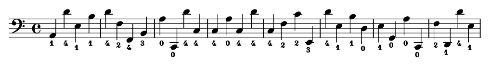
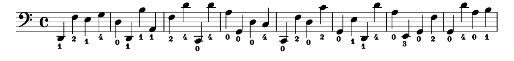
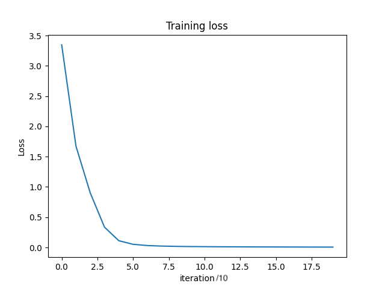

  
# Cello Fingering Prediction with Sequence-to-sequence Transformers

## Project Overview

This project aims to generate fingerings for cello music (ie which fingers to use to play each note on the sheet music) using encoder-decoder transformers. The goal is to apply the architecture of sequence-to-sequence transformers, "translating" from music notes to fingerings instead of translating one language to another.
**Note:** This project was motivated by not being able to find adequate fingerings for my sheet music, needing to watch slow motion video of online performances to decipher how to play certain sections. It is also a good opportunity to improve my knowledge of Apple's mlx library. 
**Note:** This project is new (started 24/05/2024) and a work in progress. It is on github to keep track of progress and for any suggestions from the community :) 

## Previous Work
Previous research on this topic exists, mostly for piano music (the task of generating fingerings for piano music is referred to Automatic Piano Fingering, or APF). It has shown that sequence-to-sequence transformers (along with other learning-based methods) can be useful for this task. I haven't found databases for the cello yet, so this project is a personal challenge to see what can be achieved using resources available to me.

Some references:
- [Masahiro Suzuki, "Piano Fingering Estimation and Completion with Transformers" Yamaha Corp., 2021.](https://archives.ismir.net/ismir2021/latebreaking/000007.pdf)
- [Ramoneda et al., "Automatic Piano Fingering from Partially Annotated Scores using Autoregressive Neural Networks" Association for Computing Machinery, 2022.](https://dl.acm.org/doi/10.1145/3503161.3548372)

## Project Plan

### Step 1: Overfitting a simple dataset 
- I will generate pseudo-random notes in the C major scale spanning from the lowest note on the cello (C2) to the highest note on the A string playable in first position (D4). There are 16 notes in this range. The fingerings for these notes are known, thus we have an initial dataset to play with.
- For the transformer model, I will start with a 'note level' model (ie 'character level', without a note tokenizer (very much future work). The main difference with this transformer and an Large Language Model decoder-only tranformer is the presence of cross-attention due to the decoder, as well as allowing 'future' knowledge, ie. instead of cutting off the top triangle of the matrices involved in the attention dot-product, we allow knowledge of future notes. I will need to somehow embed the notes (equivalent to 'vocabulary' in text-based models) and attempt to overfit the simple dataset to see if the decoder obtains coherent results.
- I will try to achieve this locally on an M1 Max processor using mlx as the main array and deep learning library.

### Step 2: Expand vocabulary
- Include all notes in the scale
- Label some real pieces? I'll see what the existing research says.
- Depends on how well step 1 goes :)

## Results
### Step 1 Progress
- I have trained a decoder only transformer (normally used for large language models) to overfit basic fingerings. Say we have a context length of 8, a character level language model would be trained to predict characters 2 through 9 given characters 1 through 8. Instead of this, I have trained the model to predict the fingerings for notes 1 through 8 given the notes 1 through 8. The output logits will have shape (8,num_notes) (assuming we have a batch size of 1, and num_notes is equivalent to vocab size). In a large language model we would look at the last row of logits to find the predicted note by sampling from the probabilities. In this model, we use each row to predict the fingering for every note by finding the greatest logit (argmax). We could also sample from the probabilities but in general we don't want the chance of a wrong fingering being selected. 

-Below I show 8 bars of random music in C major with its fingerings obtained through the overfitted model. We can also see the training loss as it goes to zero (as this model is very easy to overfit, since all notes only ever have one possible fingering in the training data and do not depend on other notes or fingerings).

For these data we use a custom built decoder-only transformer (a version of Andrej Karpathy's implementation in his [GPT from scratch video](https://www.youtube.com/watch?v=kCc8FmEb1nY&ab_channel=AndrejKarpathy), modified to use mlx instead of pytorch) with the following hyperparameters:
- embedding vector size: 16
- context length: 16
- learning rate: 1e-3
- vocab size (number of different notes): 16
- training iterations: 200, each with batch size of 64
- number of transformer blocks: 3
- number of self attention heads per MultiHeadAttention block: 4
- no dropout

## Contributing

This project is a work in progress. Suggestions are welcome.

