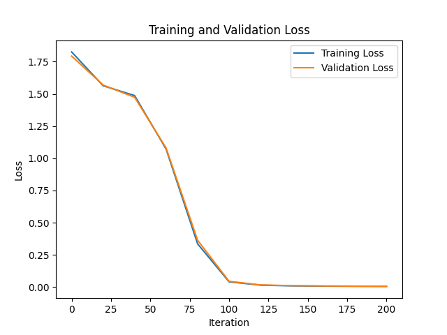

  
# Cello Fingering Prediction with Sequence-to-sequence Transformers

## Project Overview

This project aims to generate fingerings for cello music (ie which fingers to use to play each note on the sheet music) using sequence-to-sequence (seq2seq) transformers (Vaswani et al., [2017](https://doi.org/10.1109/MCI.2018.2840738)).
. The goal is to apply the architecture of seq2seq transformers, "translating" from music notes to fingerings instead of translating one language to another. 

This project was motivated by not being able to find adequate fingerings for my sheet music, needing to watch slow motion video of online performances to decipher how to play certain sections. It is also a good opportunity to improve my knowledge of Apple's mlx library. 
I started this project on 24/05/2024. It is on github to keep track of progress and for any suggestions from the community :) 

## Previous Work
Previous research on this topic exists, mostly for piano music (the task of generating fingerings for piano music is referred to Automatic Piano Fingering, or APF). It has shown that sequence-to-sequence transformers (along with other learning-based methods) can be useful for this task. 

Some references:
- [Masahiro Suzuki, "Piano Fingering Estimation and Completion with Transformers" Yamaha Corp., 2021.](https://archives.ismir.net/ismir2021/latebreaking/000007.pdf)
- [Ramoneda et al., "Automatic Piano Fingering from Partially Annotated Scores using Autoregressive Neural Networks" Association for Computing Machinery, 2022.](https://dl.acm.org/doi/10.1145/3503161.3548372)

## Project Plan

### Step 1: Overfitting a simple dataset
- The first dataset consists of pseudo-random notes in the C major scale spanning from the lowest note on the cello (C2) to the highest note on the A string playable in first position (D4). There are 16 notes in this range. The fingerings for these notes are known, thus we have an initial dataset to play with.
- I start with a 'note level' model (ie 'character level', without a note tokenizer (very much future work)). The 16 notes are represented by the integers 0 through 15, and passed through a trainable embbedding layer before being added to a positional encoding and passed through the encoder stack.  The main difference with this transformer and an Large Language Model decoder-only transformer is the presence of cross-attention with queries coming from the decoder and keys and values from the output of the encoder stack. We then overfit the simple dataset to see if the decoder obtains coherent results.
- I will try to achieve this locally on an M1 Max processor using mlx as the main array and deep learning library.

### Step 2: Expand vocabulary
- Include all notes in the scale
- Label some real pieces? I'll see what the existing research says.
- Depends on how well step 1 goes :)

## Challenges
- I haven't found labeled databases for cello music yet, but I have several strategies in mind (eg. using vision models to scan scores and extract fingerings or creating a website for people to label extracts of sheet music). There is also the potential to develop a vision model that can watch a video performance and extract fingerings based on what is seen. This task is challenging even for people, thus will be difficult to achieve.
- The choice of fingerings is very personal (depending on hand shape/size, skill/experience level as a cellist, and general preference). I am hoping the model can be fine tuned (for example with low rank adaptation to avoid too many new parameters). This could be done by feeding a small amount of music with personal fingering preference so the model adapts to each person. In the long term simply being able to tell the model to, for example, adapt to a person with a smaller hand would be ideal (although I acknowledge this is an ambitious goal).

## Results
### Step 1 Progress
#### A. Decoder only transformer
I have trained a decoder only transformer (normally used for large language models) to overfit basic fingerings. Say we have a context length of 8, a character level language model would be trained to predict characters 2 through 9 given characters 1 through 8. Instead of this, I have trained the model to predict the fingerings for notes 1 through 8 given the notes 1 through 8. The output logits will have shape (8,num_notes) (assuming we have a batch size of 1, and num_notes is equivalent to vocab size). In a large language model we would look at the last row of logits to find the predicted note by sampling from the probabilities. In this model, we use each row to predict the fingering for every note by finding the greatest logit (argmax). We could also sample from the probabilities but in general we don't want the chance of a wrong fingering being selected. 

Below I show 8 bars of random music in C major with its fingerings obtained through the overfitted model. We can also see the training loss as it goes to zero (as this model is very easy to overfit, since all notes only ever have one possible fingering in the training data and do not depend on other notes or fingerings).

#### B. Sequence-to-Sequence Transformer
The problem with the approach described in 1A is that we are not using the autoregressive property of the decoder. We predict all fingerings (for one batch) directly with one pass through the decoder stack. This also means that the model never learns to pay attention to future notes and their impact on the current fingering choice (due to the masked self-attention). 

To overcome this limitation, we introduce an encoder stack which extracts information about notes and their relative positions to each other. The encoder stack's output is then fed to each decoder block using cross-attention (with keys and values coming from the encoder output, and queries from the decoder). This approach allows each fingering prediction to have access to the entire context of notes, which is paramount, as fingerings primarily impact how we play future notes. 

We can now use the autoregressive property of the decoder by feeding in the predicted fingerings back into its input to obtain the next fingering (reusing the encoder output until we have predictions for all the notes being fed into the encoder). Below is the training and validation loss of the sequence-to-sequence model for a small dataset of 1000 randomly generated notes. Once again, both training and validation loss head to zero, as each note still only has one possible label. This approach is still useful as it ensures the model is training.

### Hyperparameters
The following hyperparameters were set for the training curves above:
- embedding dimension size: 16
- context length: 16
- learning rate: 1e-3
- vocab size encoder (number of different notes): 16
- vocob size decoder (number of different fingers): 5
- training iterations: 200, each with batch size of 64
- number of encoder and decoder block in each stack: $N_x = 3$
- number of self attention heads per MultiHeadAttention layer (parallel attention layers) : $h=4$
- Dropout during training: 0.2 (no real effect with the current training data)

## Acknowledgement
The model in this project was inspired by Andrej Karpathy's decoder-only implementation in his [GPT from scratch video](https://www.youtube.com/watch?v=kCc8FmEb1nY&ab_channel=AndrejKarpathy). 

I modified his code to use [mlx](https://github.com/ml-explore/mlx) instead of pytorch to leverage local GPU acceleration on my Apple M1 Max. I then added my own encoder and a cross attention layer for the full sequence-to-sequence model.

## Contributing

This project is a work in progress. Suggestions, contributions and corrections are very welcome.

